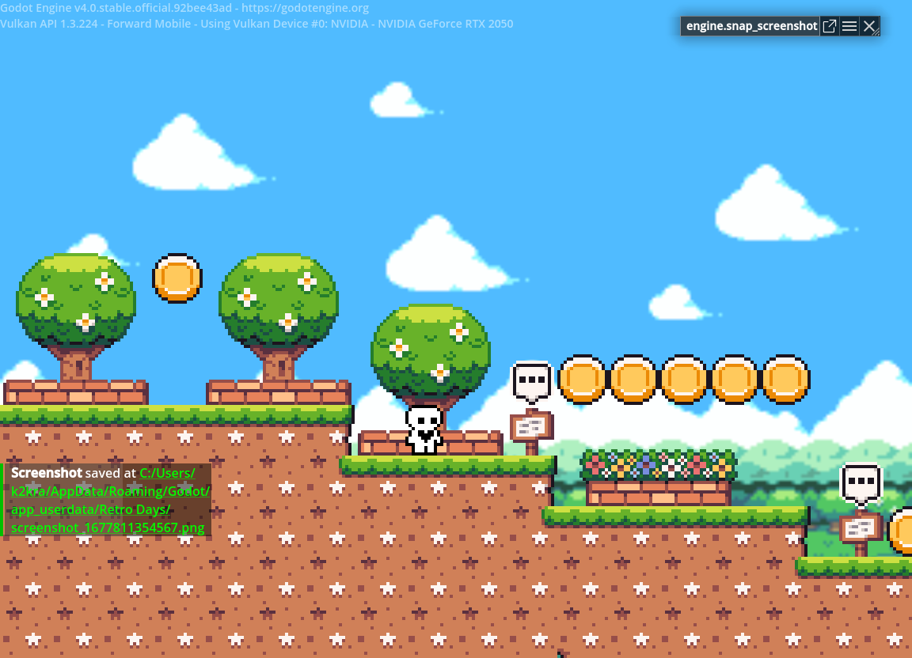

# Platformer 游戏开发计划

计划使用 Godot 开发一个简单的、纯粹的、轻松明快、复古的平台跳跃游戏，至于原因？很简单，因为我没有做过这种类型的游戏，所以我觉得有必要稍微探索一下。

计划中包含四个关卡，分别对应四个四季，每一个季节的关卡都会有自己的特色。比如说春天的关卡会有很多花朵，夏天的关卡会有很多水果，秋天的关卡会有很多树叶，冬天的关卡会有很多雪花。

游戏时常大概会在半小时以内，也许会更短？总是规模不会太大，并且我会尝试将这个游戏免费发布到Google Play应用商店，也算是初次尝试发布游戏。

素材包的话，将使用一些网络上的免费资源，grafxkid的像素Sprite包，以及HeatlyBros的音乐素材包，我觉得这两个作者都非常棒，他们的作品非常符合我对于这个游戏的设想。

在关卡设计上，我觉得自己非常缺少经验，所以我觉得可以参考一下FC上的经典游戏的设计，比如Tiny Toon Adventures (Family Computer, 1991)。

开发周期限定在四月之内完成，希望我能按时做完这件事情，如果能够找到一些志同道合的朋友一起参与进来，那就更好了。

这个项目会在完成之后贡献给开源社区，算是我的一点点小贡献吧。
